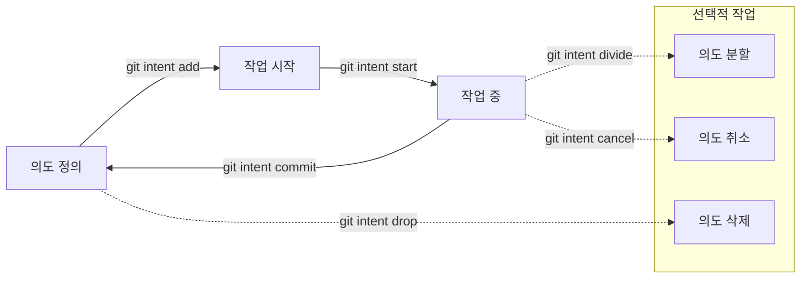

# git-intent


[English](https://github.com/offlegacy/git-intent/blob/main/README.md) | 한국어

**git-intent**는 [의도적 커밋(intentional commits)](https://intentionalcommits.org/)을 생성하기 위한 Git 워크플로우 도구입니다.

## git-intent를 사용하는 이유

많은 개발자들은 코드를 먼저 작성하고 커밋 메시지는 나중에 작성해요.  
이런 방식은 크고 모호하며 초점이 흐려진 커밋으로 이어질 수 있어요.  
**git-intent**는 테스트 주도 개발(TDD) 방식에서 영감을 받아, 코딩을 시작하기 전에 개발 의도를 명확히 정의하도록 도와줘요.  
이로써 커밋 과정이 개발 흐름의 자연스러운 일부가 될 수 있어요.

사전에 의도를 정리하면 다음과 같은 장점이 있어요
- 깔끔하고 읽기 쉬운 커밋 히스토리를 만들 수 있어요
- 개발 목적을 명확하게 전달할 수 있어요
- 작업 범위 확장을 방지하고 원자적인 커밋을 유지할 수 있어요
- 협업과 유지보수 효율이 높아져요


> [Intent-Driven Git Workflow](https://youtu.be/yDRs4Pl1Lq0?feature=shared)를 소개해주신 [Joohoon Cha](https://github.com/jcha0713)님께 감사의 마음을 전합니다.

## 워크플로우



## 빠른 시작

```bash
# 1. NPM을 사용하여 설치하세요
npm install -g git-intent

# 2. 의도를 추가하세요
git intent add "feat: 사용자 로그인 페이지 생성"

# 3. 작업을 시작하세요
git intent start
```

## 요구 사항

- Git (>= 2.0)
- Node.js (>= 18)

## 설치

### NPM 사용

```bash
npm install -g git-intent
```

### 설치 스크립트 사용 (macOS 전용)

다음 스크립트를 사용하여 Homebrew로 직접 설치할 수 있어요:

```bash
/bin/bash -c "$(curl -fsSL https://raw.githubusercontent.com/offlegacy/git-intent/main/scripts/install.sh)"
```

이 스크립트는 Homebrew를 사용하며 macOS에서만 사용 가능해요. 실행하기 전에 시스템에 Homebrew가 설치되어 있어야 해요.

### 업데이트

```bash
# NPM
npm update -g git-intent

# 버전 확인
git intent --version
```

## 사용법

### 기본 명령어

```bash
# 의도 추가
git intent add "feat: 로그인 페이지 구현"
git intent add  # 에디터를 열어 작성할 수도 있어요

# 목록과 관리
git intent list         # 모든 의도 확인
git intent show         # 현재 작업 중인 의도 보기
git intent start        # 작업 시작 (대화형)
git intent start <id>   # 특정 의도로 작업 시작

# 완료하거나 수정할 때
git intent commit                   # 현재 의도 커밋
git intent commit -m "설명 추가"    # 추가 메시지 포함
git intent cancel                   # 현재 의도 취소
git intent reset                    # 모든 의도 초기화

# 고급 명령어
git intent divide          # 의도 분할 (대화형)
git intent divide <id>     # 특정 의도 분할
git intent drop            # 의도 삭제 (대화형)
git intent drop <id>       # 특정 의도 삭제
```

## 자주 묻는 질문

**Q: 코딩 전에 의도를 정의하는 이유는 무엇인가요?**  
A: 명확하게 정의된 의도는 집중력을 유지하고, 더 의미 있는 커밋을 생성하며, 커밋 히스토리의 협업과 가독성을 향상시키는 데 도움이 돼요.

**Q: 내 의도는 어디에 저장되나요? Git에 공유되거나 커밋되나요?**  
A: 의도는 저장소의 `.git` 디렉토리에 로컬로 저장되며 공유되거나 커밋되지 않아요. 별도로 공유하지 않는 한 개인적으로만 유지돼요.

## 기여하기

여러분의 기여를 언제나 환영합니다. 자세한 가이드는 다음을 참조하세요.

[CONTRIBUTING.md](./CONTRIBUTING.md)

## 라이선스

MIT [OffLegacy](https://www.offlegacy.org/) — [LICENSE](https://github.com/offlegacy/git-intent/blob/main/LICENSE)
