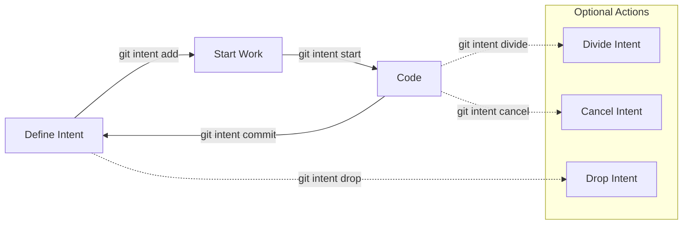

# git-intent


English | [한국어](https://github.com/offlegacy/git-intent/blob/main/README.ko.md)

**git-intent** is a Git workflow tool designed for creating [intentional commits](https://intentionalcommits.org/).

## Why git-intent?

Most developers tend to write code first and only think about commit messages afterward.  
This often results in large, unfocused, and unclear commits.  
Inspired by the Test-Driven Development (TDD) approach, **git-intent** helps you define clear intents before you start coding, making your commit process an intentional part of development.

By focusing on your intent before coding, **git-intent** helps you:

- Maintain a clean and navigable commit history
- Clearly communicate your development purpose
- Prevent scope creep and ensure atomic changes
- Improve collaboration and project maintainability

> Special thanks to [Joohoon Cha](https://github.com/jcha0713) for introducing the [Intent-Driven Git Workflow](https://youtu.be/yDRs4Pl1Lq0?feature=shared) concept.

## Workflow



## Quick Start

```bash
# 1. Install Using NPM
npm install -g git-intent

# 2. Add an intention
git intent add "feat: create user login page"

# 3. Start working
git intent start
```

## Requirements

- Git (>= 2.0)
- Node.js (>= 18)

## Installation

### Using NPM

```bash
npm install -g git-intent
```

### Using Install Script (macOS only)

You can install git-intent directly using our install script with Homebrew:

```bash
/bin/bash -c "$(curl -fsSL https://raw.githubusercontent.com/offlegacy/git-intent/main/scripts/install.sh)"
```

This script uses Homebrew and is only available for macOS. Homebrew must be installed on your system before running this script.

### Updating

```bash
# NPM
npm update -g git-intent

# Check version
git intent --version
```

## Usage

### Basic Commands

```bash
# Add intentions
git intent add "feat: implement login page"
git intent add  # opens editor

# List and manage
git intent list    # show all intentions
git intent show    # show current intention
git intent start   # start working (interactive)
git intent start <id>  # start specific intention

# Complete or modify
git intent commit  # commit current intention
git intent commit -m "Additional message"  # with extra details
git intent cancel  # cancel current intention
git intent reset   # clear all intentions

# Advanced
git intent divide  # split intention (interactive)
git intent divide <id>  # split specific intention
git intent drop  # remove intention (interactive)
git intent drop <id>    # remove specific intention
```

## FAQ

**Q: Why define intentions before coding?**  
A: Clearly defined intentions help you stay focused, create more meaningful commits, and improve collaboration and readability of commit history.

**Q: Where are my intentions stored? Are they shared or committed to Git?**  
A: Intentions are stored locally in your repository's `.git` directory and are not shared or committed. They remain private unless explicitly shared.

## Contributing

We warmly welcome contributions from the community. See our detailed guide:

[CONTRIBUTING.md](https://github.com/offlegacy/git-intent/blob/main/CONTRIBUTING.md)

## License

MIT [OffLegacy](https://www.offlegacy.org/) — [LICENSE](https://github.com/offlegacy/git-intent/blob/main/LICENSE)
